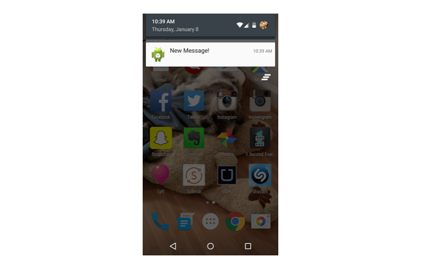
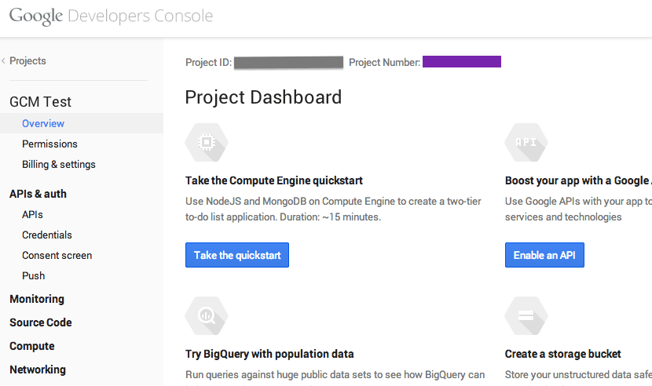

#Send Push Notifications in Your Android Messaging App Using GCM



This tutorial builds off the finished messaging app from our earlier tutorial on [Android messaging with Parse](https://www.sinch.com/tutorials/android-messaging-tutorial-using-sinch-and-parse/).

If you wish to skip the first tutorial, you can clone the finished source code [from Github](https://github.com/sinch/android-messaging-tutorial). You will need to add your Sinch key and secret to `MessageService.java`, and your Parse keys to `MyApplication.java`. Remember to [sign up for a Sinch account](https://www.sinch.com/dashboard/#/signup).

For your convenience, I've built a sample backend in Ruby that you can use to send the push notifications. [Clone this repository](https://github.com/sinch/push-backend-ruby) and follow the instructions in the README to set it up.

##Permissions

To save time, here are all of the permissions that you will need to add to `AndroidManifest.xml` throughout the tutorial:

```
<uses-permission android:name="com.google.android.c2dm.permission.RECEIVE"/>
<uses-permission android:name="android.permission.GET_ACCOUNTS" />
<uses-permission android:name="android.permission.WAKE_LOCK" />
<permission android:name="com.sinch.messagingtutorial.app.permission.C2D_MESSAGE"
                android:protectionLevel="signature" />
<uses-permission android:name="com.sinch.messagingtutorial.app.permission.C2D_MESSAGE" />
<uses-permission
        android:name="com.google.android.c2dm.permission.RECEIVE" />
```

##Get current users’ Google Play IDs

First, add the Google Play services library to your project by inserting the following line in your `build.gradle` file dependencies:

```compile "com.google.android.gms:play-services:4.0.+"```

Each user has a unique Google Play ID. Use an async task to fetch this while the user is logging in. First, you will need to get your project number from the Google developer console. At the top of the overview page for your project, you will see a project number like so:



Using your project ID, declare the following in `LoginActivity.java onCreate`:

```
final GoogleCloudMessaging gcm = GoogleCloudMessaging.getInstance(getApplicationContext());

    class RegisterGcmTask extends AsyncTask<Void, Void, String> {

        String msg = "";

        @Override
        protected String doInBackground(Void... voids) {
            try {
                msg = gcm.register("your-project-number");
            } catch (IOException ex) {
                msg = "Error :" + ex.getMessage();
            }
                return msg;
        }

        @Override
        protected void onPostExecute(String msg) {
            intent = new Intent(getApplicationContext(), ListUsersActivity.class);
            serviceIntent = new Intent(getApplicationContext(), MessageService.class);

            serviceIntent.putExtra("regId", msg);

            startActivity(intent);
            startService(serviceIntent);
        }
    }
```
    
Then, change the three instances of this:

```
startService(serviceIntent);
startActivity(intent);
```
    
to this:

```(new RegisterGcmTask()).execute();```
    
Next, in `MessageService.java`, you can retrieve this ID in `onStartCommand`:

```
//declare globally
    private String regis;

//onStartCommand
    regId = intent.getStringExtra("regId");
```


##Register push data with Sinch

Sinch takes care of deciding when a push notification needs to be sent (when the user is offline). To turn this feature on, add the following line in `MessageService.java` right before `sinchClient.start();`

`sinchClient.setSupportPushNotifications(true);`
    
And then, after starting the Sinch client, register the current user's Google Play ID with Sinch so Sinch knows where to deliver the message:

`sinchClient.registerPushNotificationData(regId.getBytes());`
    
##Send the push notification

Open up `MessagingActivity.java`. In `MyMessageClientListener`, you will see `onShouldSendPushData`; this is where you will send a push notification request to your backend:

```
//get the id that is registered with Sinch
    final String regId = new String(pushPairs.get(0).getPushData());

//use an async task to make the http request
    class SendPushTask extends AsyncTask<Void, Void, Void> {

@Override
   protected Void doInBackground(Void... voids) {
       HttpClient httpclient = new DefaultHttpClient();
       //url of where your backend is hosted, can't be local!
       HttpPost httppost = new HttpPost("http://your-domain.com?reg_id=" + regId);            

       try {
           HttpResponse response = httpclient.execute(httppost);
           ResponseHandler<String> handler = new BasicResponseHandler();
           Log.d("HttpResponse", handler.handleResponse(response));
       } catch (ClientProtocolException e) {
           Log.d("ClientProtocolException", e.toString());
       } catch (IOException e) {
           Log.d("IOException", e.toString());
       }

       return null;
   }    
}

(new SendPushTask()).execute();
```
    
##Receive push notifications

The app also needs to be able to wake up the device and deliver push notifications as they arrive. To wake the device, create `GcmBroadcastReceiver.java`:

```
//in AndroidManifest.xml
    
<receiver
   android:name=".GcmBroadcastReceiver"
   android:permission="com.google.android.c2dm.permission.SEND" >
   <intent-filter>
       <action android:name="com.google.android.c2dm.intent.RECEIVE" />
       <category android:name="com.google.android.gcm.demo.app" />
   </intent-filter>
</receiver>
    
//GcmBroadcastReceiver.java
    
import android.app.Activity;
import android.content.ComponentName;
import android.content.Context;
import android.content.Intent;
import android.support.v4.content.WakefulBroadcastReceiver;

public class GcmBroadcastReceiver extends WakefulBroadcastReceiver {

   @Override
   public void onReceive(Context context, Intent intent) {
       ComponentName comp = new ComponentName(context.getPackageName(),
               GcmIntentService.class.getName());
       startWakefulService(context, (intent.setComponent(comp)));
       setResultCode(Activity.RESULT_OK);
   }
}
```


Finally, your app should display the push notification and open the app when clicked. Create `GcmIntentService.java` to do so:

```
//in AndroidManifest.xml
    
<service android:name=".GcmIntentService" />
    
//GcmIntentService.java
    
import android.app.IntentService;
import android.app.NotificationManager;
import android.app.PendingIntent;
import android.content.Context;
import android.content.Intent;
import android.support.v4.app.NotificationCompat;

public class GcmIntentService extends IntentService {
   public static final int NOTIFICATION_ID = 1;
   private NotificationManager mNotificationManager;

   public GcmIntentService() {
       super("GcmIntentService");
   }

   @Override
   protected void onHandleIntent(Intent intent) {

       mNotificationManager = (NotificationManager)
           this.getSystemService(Context.NOTIFICATION_SERVICE);

       PendingIntent contentIntent = PendingIntent.getActivity(this, 0,
           new Intent(this, LoginActivity.class), 0);

       NotificationCompat.Builder mBuilder =
           new NotificationCompat.Builder(this)
               .setSmallIcon(R.drawable.ic_launcher)
               .setContentTitle("New Message!");

       mBuilder.setContentIntent(contentIntent);
       mNotificationManager.notify(NOTIFICATION_ID, mBuilder.build());

       GcmBroadcastReceiver.completeWakefulIntent(intent);
   }
}
```
    
##Test it out

Register two users for the app and close the app on one of the devices. From the app that is still open, send a message to the user with the closed app. Within a few seconds, you will see a push notification on the device. (The speed of this depends on how fast GCM decides to deliver it.)

Happy coding! If you have any questions, feel free to reach out to us on [Twitter](https://twitter.com/sinchdev) or via our [help page](https://www.sinch.com/help/dev-support/).
